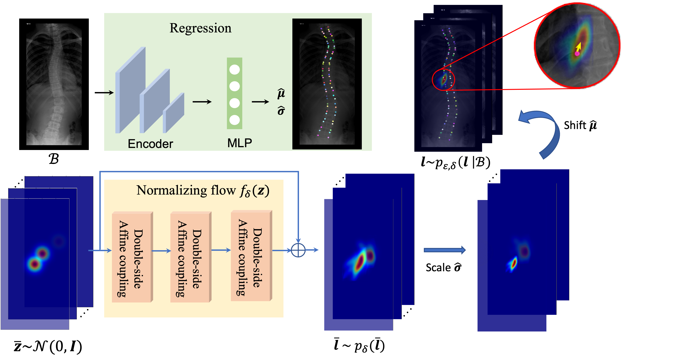

# Landmark Localization from Medical Images with Generative Distribution Prior


> Zixun Huang, Rui Zhao, Frank H.F. Leung, Sunetra Banerjee, Kin-Man Lam, Yong-Ping Zheng, Sai Ho Ling   

<div align="center">
    <br>
    Normalizing flow-based distribution prior
</div>


### Installation
1. Install pytorch >= 1.6.0 following official instruction.
2. Install `NFDP`:
``` bash
pip install cython
python setup.py develop
```
3. Download [X-ray Spine](https://aasce19.github.io/) dataset, [X-ray Cephalograms](https://figshare.com/s/37ec464af8e81ae6ebbf) dataset, [X-ray Hand](https://www.ipilab.org/BAAweb) ([annotations](https://github.com/christianpayer/MedicalDataAugmentationTool-HeatmapRegression/tree/master/hand_xray/hand_xray_dataset)) dataset :
```
|-- data
`-- |-- X-ray Spine
    |   |-- labels
    |   |   |-- train
    |       |   | sunhl-1th-02-Jan-2017-162 A AP.jpg.mat
    |       |   | sunhl-1th-02-Jan-2017-162 B AP.jpg.mat
    |       |   |-- ... 
    |       `-- val
    |       `-- test
    |   `-- data
    |       |-- train
    |       |   |-- sunhl-1th-02-Jan-2017-162 A AP.jpg
    |       |   |-- sunhl-1th-02-Jan-2017-162 B AP.jpg
    |       |   |-- ... 
    |       `-- val
    |       `-- test
    |-- X-ray Cephalograms
    |   |-- 400_junior
    |   |   `-- 001.txt
    |   |-- 400_senior
    |   |   `-- 001.txt
    |   `-- RawImage
            |-- TrainingData
            |   |-- 001.bmp
            |   |-- 002.bmp
            |   |--- ...
            `-- Test1Data
            `-- Test2Data
    |-- X-ray Hand
    `-- |-- annotations
        |   |-- all.csv
        `-- Images
            3128.jpg
        `-- cv
            |-- set1
                |-- test.txt
                |-- train.txt
            `-- set2
            `-- set3
```
## Training

### Train on X-ray Spine with Reg. NFDP
``` bash
./scripts/train.sh ./configs/512x256_res18_sp_regress_NFDP.yaml train_sp_reg_nfdp
```
### Train on X-ray Spine with Hm. NFDP
``` bash
./scripts/train.sh ./configs/512x256_res18_sp_heatmap_NFDP.yaml train_sp_hm_nfdp
```
### Train on X-ray Cephalograms with Hm. NFDP
``` bash
./scripts/train.sh ./configs/512x512_res18_ce_heatmap-NFDP.yaml train_ce_hm_nfdp
```
### Train on X-ray Hand with Hm. NFDP
``` bash
./scripts/train.sh ./configs/512x512_res18_hd_heatmap-NFDP.yaml train_hd_hm_nfdp
```
## Evaluation

### Validate on X-ray Spine
``` bash
./scripts/validate.sh ./configs/512x256_res18_sp_heatmap_NFDP.yaml ./path/to/checkpoint.pth
```

### Validate on X-ray Cephalograms
``` bash
./scripts/validate_ce.sh ./configs/512x512_res18_ce_heatmap-NFDP.yaml ./path/to/checkpoint.pth
```
